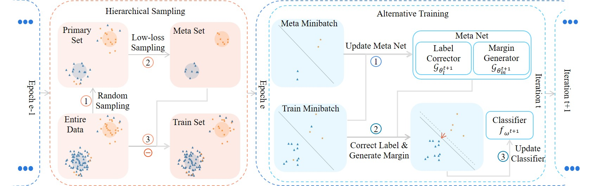
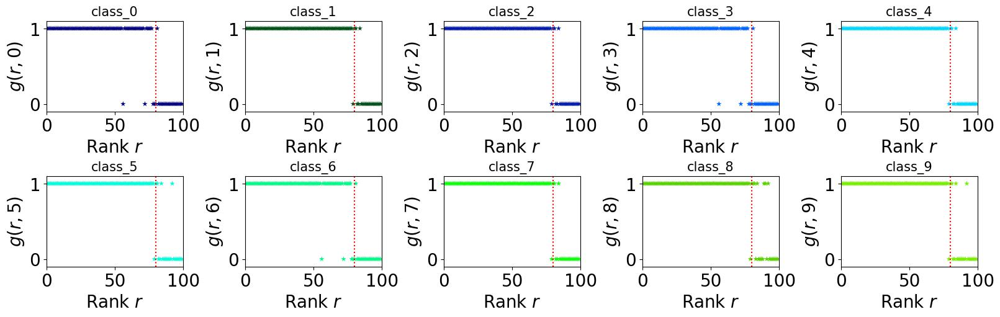
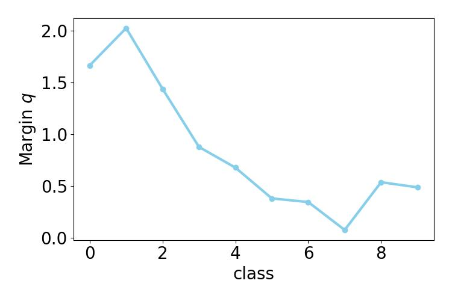

# Dynamic Loss for Robust Learning
This repository contains the source code for the research paper 'Dynamic Loss for Robust Learning,' built upon the [mmclassification](https://github.com/open-mmlab/mmpretrain/tree/mmcls-0.x) framework. 

<div align="center">
  
</div>

## Requirements
* Python 3
* yapf (version ====0.40.1)
* [PyTorch](https://pytorch.org/) (version == 1.7.1)
* [yaml](https://pyyaml.org/wiki/PyYAMLDocumentation)
* [higher](https://github.com/facebookresearch/higher)(version == 0.2.1)
* [mmcv-full](https://github.com/open-mmlab/mmcv) (version == 1.5.0)

## Installation

The installation process is similar to [mmclassification](https://github.com/open-mmlab/mmpretrain/tree/mmcls-0.x). Please follow the same steps. 

## Training

``` 
python tools/train_meta.py configs/metadynamic/metadynamic_resnet32_cifar10_cor0.2_imb0.1.py 
``` 

## Visualization
After training, you can visualize the rank weight and margin.

``` 
python python tools/visualize_tools/vis_rank_margin.py --config configs/metadynamic/metadynamic_resnet32_cifar10_cor0.2_imb0.1.py --checkpoint work_dirs/metadynamic_resnet32_cifar10_cor0.2_imb0.1/latest.pth
``` 

The image will save in directory 'work_dir/metadynamic_resnet32_cifar10_cor0.2_imb0.1/'.

The label correct weight of each rank in each class.
<div align="center">
  
</div>

Per class margin.
<div align="center">
  
</div>

## Citation

If you find Dynamic Loss useful, please cite the following paper

```
@ARTICLE{10238823,
  author={Jiang, Shenwang and Li, Jianan and Zhang, Jizhou and Wang, Ying and Xu, Tingfa},
  journal={IEEE Transactions on Pattern Analysis and Machine Intelligence}, 
  title={Dynamic Loss for Robust Learning}, 
  year={2023},
  volume={45},
  number={12},
  pages={14420-14434},
  doi={10.1109/TPAMI.2023.3311636}}
```

### Acknowledgement

The code is based on [mmclassification](https://github.com/open-mmlab/mmpretrain/tree/mmcls-0.x) and [BalancedMetaSoftmax](https://github.com/jiawei-ren/BalancedMetaSoftmax-Classification).Thanks for their great contributions on the computer vision community.